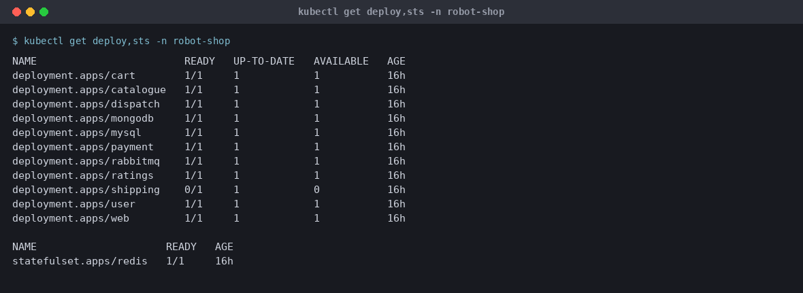
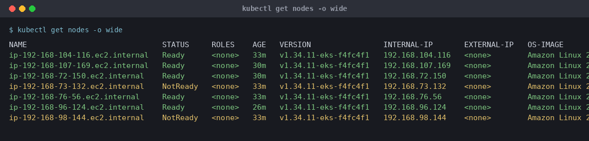
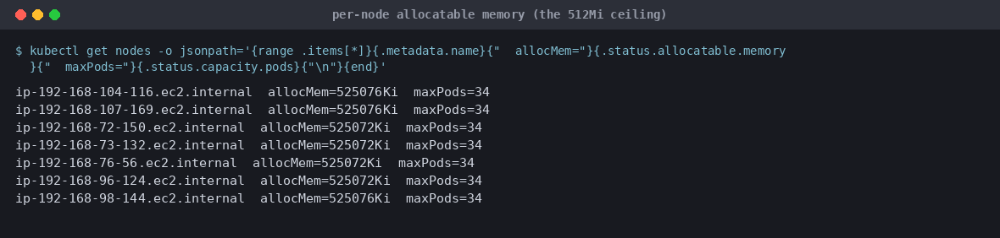
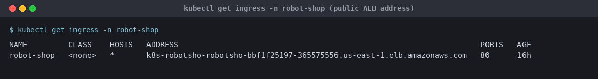
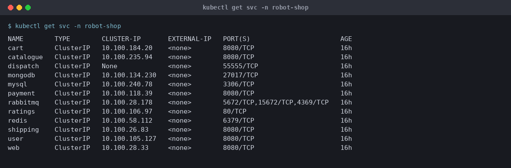
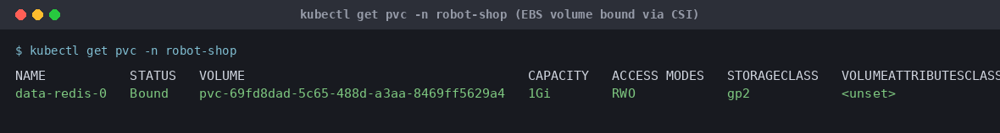
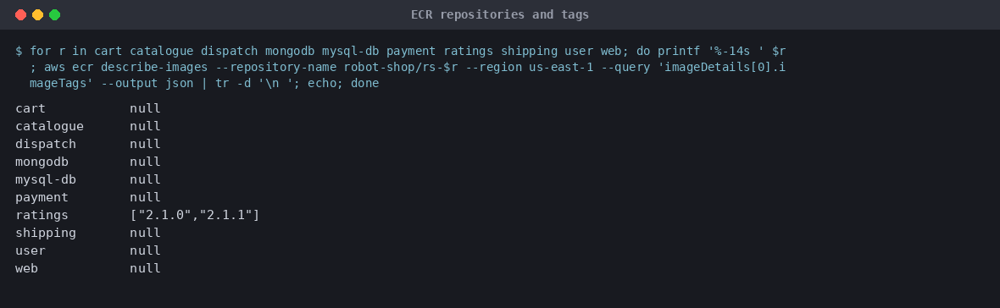
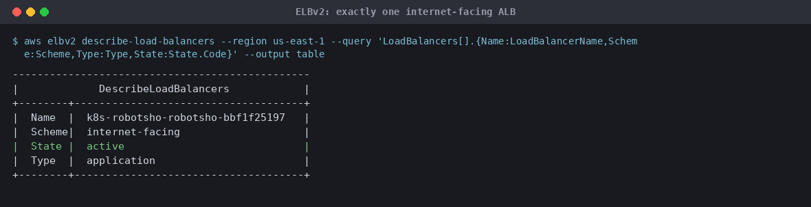
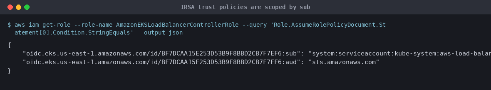
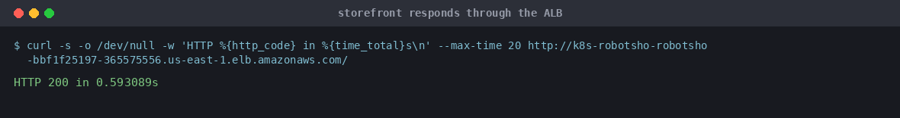

# Stan's Robot Shop on AWS EKS

A 12-service microservices storefront deployed to Amazon EKS, with every
container image built from the Dockerfiles in this repo and pushed to a private
Amazon ECR registry. Helm renders the whole application; an AWS Load Balancer
Controller puts a public ALB in front of it.

Upstream: [`iam-veeramalla/three-tier-architecture-demo`](https://github.com/iam-veeramalla/three-tier-architecture-demo),
itself a fork of [`instana/robot-shop`](https://github.com/instana/robot-shop).
Apache 2.0, see [`LICENSE`](LICENSE).

---

## What is in here

| Path | What it is |
|---|---|
| `cart/ catalogue/ dispatch/ mongo/ mysql/ payment/ ratings/ shipping/ user/ web/` | one service per directory, each with its own `Dockerfile` and build context |
| `EKS/helm/` | the Helm chart that deploys the app |
| `EKS/01`–`05-*.md` | the EKS setup steps, as they were actually performed |
| `eksctl/cluster.yaml` | control plane + node group, reproducible from scratch |
| `scripts/build-push.sh` | builds all 10 images and pushes them to ECR |
| `docs/troubleshooting.md` | the nine failures hit while building this, with real error output |

---

## Architecture

```
                      internet
                          │
              ┌───────────▼───────────┐
              │  ALB (internet-facing) │   aws-load-balancer-controller
              │  target-type: ip      │   provisions from EKS/helm/ingress.yaml
              └───────────┬───────────┘
                          │ :8080
              ┌───────────▼───────────┐
              │           web         │   nginx, static AngularJS frontend
              └───────────┬───────────┘
        ┌──────────┬───────┴────┬──────────┬───────────┐
   ┌────▼────┐┌────▼────┐┌──────▼─────┐┌───▼─────┐┌────▼────┐
   │catalogue││   user  ││   cart    ││ payment ││shipping │
   └────┬────┘└────┬────┘└──────┬─────┘└───┬─────┘└────┬────┘
        │          │             │          │           │
   ┌────▼────┐┌────▼────┐   ┌────▼────┐┌───▼──────┐    │
   │ mongodb ││  redis  │   │rabbitmq ││  mysql   │◄───┘
   └─────────┘└─────────┘   └─────────┘└──────────┘
        └──────────────── ratings ─────────────────┘
```

Presentation tier is `web` (nginx). Business tier is the eight Node/Java/Go/PHP
services. Data tier is `mongodb`, `mysql`, `redis` and `rabbitmq`. The chart
models the data tier as a `StatefulSet` for `redis` (it owns a `gp2` PVC) and
`Deployments` for the rest.

`dispatch` and `payment` consume a RabbitMQ queue; `ratings` (PHP/Apache) reads
`mysql`; `catalogue`, `user` and `cart` read `mongodb` and `redis`.

---

## Prerequisites

`kubectl`, `eksctl`, `aws` CLI v2, `helm` v3, `docker`, and a hostname in
`~/.kube/config` pointing at the cluster.

---

## Deploying

### 1. Cluster

```bash
eksctl create cluster -f eksctl/cluster.yaml
aws eks update-kubeconfig --name wisdom-eks --region us-east-1
```

Creates the VPC across two AZs, the control plane, and a `t3.micro` node group
with VPC CNI prefix delegation enabled.

### 2. OIDC provider, ALB controller, EBS CSI driver

These are IRSA roles, so they must be created *after* the control plane exists --
their trust policy embeds the cluster's OIDC issuer. See:

- [`EKS/03-oidc-IAM.md`](EKS/03-oidc-IAM.md)
- [`EKS/04-alb-configuration.md`](EKS/04-alb-configuration.md)
- [`EKS/05-ebs-csi-driver.md`](EKS/05-ebs-csi-driver.md)

```bash
eksctl utils associate-iam-oidc-provider --cluster wisdom-eks --approve
```

### 3. Build and push images

```bash
./scripts/build-push.sh                 # all ten
./scripts/build-push.sh cart web        # just two
TAG=2.1.1 ./scripts/build-push.sh       # different tag
```

The script creates each ECR repository if absent, so it is safe to re-run.

### 4. Deploy

```bash
kubectl create ns robot-shop
helm install robot-shop ./EKS/helm --namespace robot-shop \
  --set image.repo=<account>.dkr.ecr.us-east-1.amazonaws.com/robot-shop \
  --set image.version=2.1.0

kubectl apply -f EKS/helm/ingress.yaml
```

Watch it come up:

```bash
kubectl get pods -n robot-shop -w
kubectl get ingress -n robot-shop      # ADDRESS is the public URL
```

### 5. Verify

```bash
curl -s -o /dev/null -w '%{http_code}\n' http://<ALB-DNS-name>/
```

---

## Running state

**These captures are a historical record, taken from the cluster before it was
deleted.** They are not live output and cannot be regenerated -- the cluster
and the tooling that produced them are both gone. They are kept because the
numbers in them are the evidence behind the capacity section below, and because
several of them show failures that would otherwise be invisible.

If you rebuild the cluster, take fresh captures rather than trusting these:
pod names, node names and timestamps are from a cluster that no longer exists.

**Workloads** -- 11 of 12 ready. `shipping` is the one that does not fit; see
the capacity section below.



**Nodes** -- `maxPods=34`, thanks to prefix delegation. Without it these would
all be `4` and nothing would schedule.



**The constraint that decides everything.** Each node offers 512Mi of
allocatable memory, not the 933Mi the instance advertises.



**Public entry point** -- one ALB, `internet-facing`, `target-type: ip`.



**`web` is `ClusterIP`.** Upstream renders `LoadBalancer` here, which produces a
second, internal, externally-unreachable NLB alongside the ALB.



**EBS working** -- Redis's claim is bound to a real volume by the CSI driver.



**Images** -- all ten built locally and pushed to ECR.



**One load balancer**, not two.



**IRSA trust scoped by `sub`**, not just `aud`.



**Storefront responding** through the ALB.



See [`docs/screenshots/README.md`](docs/screenshots/README.md) for the full list
and for a guide to capturing the Lens and AWS Console views, which are not
included here.

---

## Design decisions worth knowing

**`web` is a `ClusterIP`, not a `LoadBalancer`.** Upstream `web-service.yaml`
renders `type: LoadBalancer` whenever `nodeport` is false. Combined with
`ingress.yaml` that produces *two* load balancers in front of the same app: an
internal NLB (from the Service) and a public ALB (from the Ingress). The chart
template now defaults to `ClusterIP`, configurable via `web.serviceType`. The
ALB targets pod IPs directly (`target-type: ip`), so it does not need a
LoadBalancer Service, and this halves the load balancer bill. The internal NLB
was unreachable from outside the VPC anyway, so nothing was lost.

**`mysql` and `shipping` resource requests come from `values.yaml`.** The
upstream templates hardcode `700Mi` and `500Mi` requests. A `t3.micro` only has
512Mi allocatable, so `mysql` could never be scheduled at any node count. Both
are now values-driven, and `shipping`'s JVM flags in its `Dockerfile` were
matched to its new limit. See
[`docs/troubleshooting.md`](docs/troubleshooting.md) #3 and #4.

**No `PodSecurityPolicy`.** Upstream ships four PSP templates and a guard in
every workload template. PSP was removed from Kubernetes in 1.25 and this
cluster is 1.34, so `policy/v1beta1` could never apply -- they were deleted
rather than left switched off. `PodSecurityAdmission` is the supported
replacement and is namespace-scoped, not chart-scoped.

---

## Capacity: read this before scaling

This was built against a free-tier AWS account, and that is a real constraint,
not a formality. Measured numbers:

- `t3.micro` advertises 933Mi RAM but only **512Mi is allocatable** per node.
- Robot Shop requests **1056Mi** in total; `kube-system` claims roughly
  **175Mi on every node** for `aws-node`, `kube-proxy`, `coredns`,
  `ebs-csi-node` and the ALB controller.
- At 4 nodes that is ~1756Mi of 2048Mi — **86% committed before any CPU is
  considered.** Under that load kubelets starved, nodes went
  `NodeStatusUnknown`, and the storefront returned 503.
- 7 nodes brings it to roughly 64%. That helps, but it does not fix the real
  problem: the scheduler stacks `mysql` and `rabbitmq` together and pushes a
  node to 99% memory, which evicts pods and then starves kubelet.

On a paid account, use `t3.small` or larger and stop fighting this. If staying
on `t3.micro`, add `topologySpreadConstraints` or pod anti-affinity to the chart
so no single node gets overloaded. Cost note: 7 × `t3.micro` is ~5088 instance
hours per month against a 750-hour free allowance, so roughly $40-50/month.

Also relevant: `t3` is burstable. `T3Unlimited` was not enabled here, so once CPU
credits deplete the instance is throttled to its ~20% baseline.

---

## Teardown

Order matters, and getting it wrong costs an afternoon:

```bash
# 1. Cluster first, while the ALB controller is still installed. If you remove
#    the controller first, nothing reconciles the Ingress, the ALB is orphaned,
#    and `eksctl delete cluster` times out waiting for it.
eksctl delete cluster --name wisdom-eks --region us-east-1

# 2. Node groups the console created. eksctl only tracks node groups it created
#    itself; a Console-made one is invisible to it and the control plane stack
#    fails with "Cluster has nodegroups attached (409)".
eksctl delete nodegroup --name ng-micro-17 --cluster wisdom-eks --drain=false
```

If `delete cluster` fails on a stuck VPC, the blocker is usually security groups
left by a load balancer. Delete them, then re-issue the stack delete -- a
`DELETE_FAILED` stack will not retry on its own:

```bash
aws ec2 delete-security-group --group-id sg-...
aws cloudformation delete-stack --stack-name eksctl-<name>-cluster
```

`--drain=false` skips pod eviction. Use it when pods are already wedged on
`NotReady` nodes and the whole cluster is going anyway; draining will otherwise
hang until it times out.

**The cluster delete does not remove ECR repositories** -- they live in the
account, not the cluster:

```bash
for r in cart catalogue dispatch mongodb mysql-db payment ratings shipping user web; do
  aws ecr delete-repository --repository-name robot-shop/rs-$r --region us-east-1 --force
done
```

---

## Running it locally instead

`docker-compose.yaml` and `.env` are intact if you want to iterate without a
cluster. It builds the same ten service directories and pulls the same public
`redis` and `rabbitmq` images:

```bash
docker compose build
docker compose up
```

Storefront on <http://localhost:8080>. Images land as `robotshop/rs-<service>:2.1.0`
from `.env`, not in ECR -- that path is only for local iteration. Use
`./scripts/build-push.sh` for anything that goes to Kubernetes.

The upstream `docker-compose-load.yaml` has been removed: it needs a `load-gen/`
directory that is not part of this repo, so it could not run.

---

## Credits

Application and original Dockerfiles: [instana/robot-shop](https://github.com/instana/robot-shop),
Apache 2.0. EKS-specific material: [iam-veeramalla/three-tier-architecture-demo](https://github.com/iam-veeramalla/three-tier-architecture-demo).
